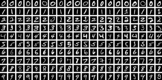
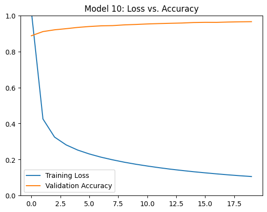

# [A neural network trained to identify handwritten numbers 0-9](/)

Developed with two classmates, Angelo and Winry, as part of a class project.
We learned all about neural networks:
* Perceptron vs. Sigmoid Neurons
* Backpropogation
* Gradient Descent
* Alternative activation functions
 * Relu
 * Tanh
 * Softmax
* Undefitting vs. Overfitting
* L1 and L2 regularization
* Kfolding
* Dropout

Trained using the MNIST dataset:

Our best training results had an accuracy of 97.11%

